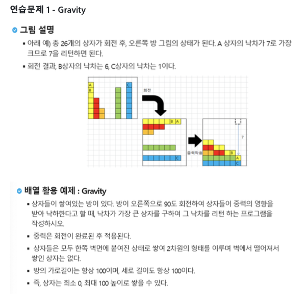

# 연습 문제 1. Gravity

## 문제 출처

## 💡 접근 방식 1

### 1. 사용 알고리즘
* **구현(Implementation)**
* **배열 순회(Array Traversal)**

### 2. 문제 풀이 과정
1.  먼저 테스트 케이스의 개수 `T`를 입력받고, 각 테스트 케이스마다 방의 가로 길이 `N`과 상자의 개수를 담은 리스트 `boxes`를 입력받습니다.
2.  각 상자의 낙차를 저장할 리스트 `drop`을 `N` 크기로 0으로 초기화합니다.
3.  이중 반복문을 사용하여 각 상자(`i`)의 낙차를 계산합니다.
    * 바깥쪽 반복문은 첫 번째 상자부터 마지막 상자까지 순회합니다.
    * 안쪽 반복문은 현재 상자(`i`)의 바로 오른쪽 상자부터 끝까지 순회합니다.
4.  안쪽 반복문에서는 현재 상자의 높이(`boxes[i]`)보다 오른쪽에 있는 상자의 높이(`boxes[j]`)가 낮은 경우, `count`를 1씩 증가시켜 낙차량을 계산합니다.
5.  안쪽 반복문이 종료되면, 계산된 `count` 값을 `drop[i]`에 저장합니다.
6.  모든 상자에 대한 낙차 계산이 완료되면, `drop` 리스트에서 가장 큰 값(`max_drop`)을 찾습니다.
7.  최종적으로 `max_drop` 값을 테스트 케이스 번호와 함께 출력 형식에 맞춰 출력합니다.

---

### 💻 코드
* [9999.py](9999.py)
