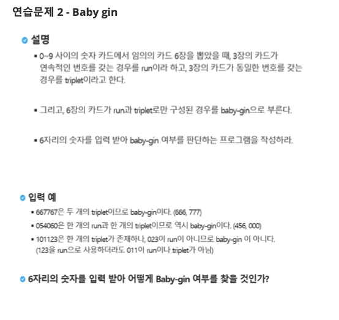

# 9999. Baby Gin

## 문제 출처

## 💡 접근 방식

### 1. 사용 알고리즘
* **구현(Implementation)**
* **카운팅 정렬(Counting Sort)** 및 **그리디(Greedy)**

### 2. 문제 풀이 과정
1.  먼저 0부터 9 사이의 숫자 카드 6장을 입력받아 카운트 배열 `count`에 각 숫자의 개수를 기록합니다. `run` 검사를 위해 배열의 크기는 여유 있게 12로 설정합니다.
2.  `triplet`과 `run`의 개수를 저장할 변수를 `0`으로 초기화하고, 카운트 배열을 순회할 인덱스 `idx`를 `0`으로 초기화합니다.
3.  `while` 반복문을 사용하여 `idx`가 10 미만일 동안 `triplet`과 `run`을 찾습니다.
4.  현재 인덱스 `idx`의 숫자가 3개 이상 존재하면(`count[idx] >= 3`), `triplet`을 1 증가시키고 해당 숫자의 개수를 3 감소시킨 후 `continue`를 통해 현재 인덱스부터 다시 검사합니다.
5.  `triplet`이 발견되지 않고, 현재 숫자와 다음 두 숫자가 모두 1개 이상 존재하면(`count[idx] >= 1` and `count[idx+1] >= 1` and `count[idx+2] >= 1`), `run`을 1 증가시키고 해당 세 숫자의 개수를 1씩 감소시킨 후 `continue`를 통해 현재 인덱스부터 다시 검사합니다.
6.  `triplet` 또는 `run`을 찾지 못했다면 `idx`를 1 증가시켜 다음 숫자로 넘어갑니다.
7.  `while` 반복문이 종료된 후, `triplet`과 `run`의 합이 `2`이면 Baby Gin이므로 `1`을, 그렇지 않으면 `0`을 반환합니다.

---

## 💻 코드
* [9999.py](9999.py)