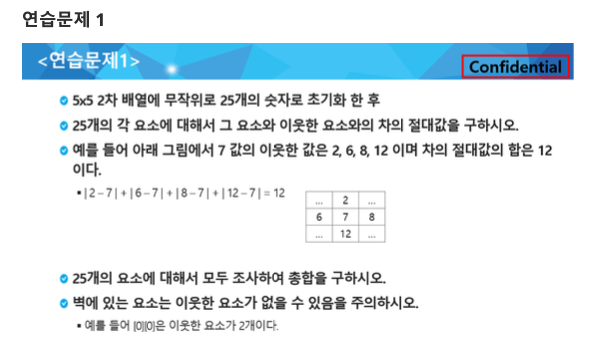

# 0000. delta 연습문제

## 문제 출처

## 💡 접근 방식 1

### 1. 사용 알고리즘
* **구현(Implementation)**
* **2차원 배열 순회** 및 **방향 벡터(Delta Array)**

### 2. 문제 풀이 과정
1.  먼저 테스트 케이스의 개수 `T`를 입력받고, 각 테스트 케이스마다 배열의 크기 `N`과 `N x N` 크기의 2차원 배열 `arr`를 입력받습니다.
2.  상하좌우 4방향을 탐색하기 위해 `dr` (행 방향 변화)과 `dc` (열 방향 변화)의 방향 벡터(delta array)를 정의합니다.
3.  절댓값의 누적 합을 저장할 `result` 변수를 `0`으로 초기화합니다.
4.  이중 반복문을 사용하여 배열 `arr`의 모든 위치 `(r, c)`를 순회합니다.
5.  각 위치 `(r, c)`에 대해 다시 `for` 반복문을 사용하여 4방향 델타 배열을 순회하며 인접한 위치 `(nr, nc)`를 계산합니다.
6.  `if` 조건문을 사용하여 `(nr, nc)`가 배열의 범위를 벗어나지 않는지 확인합니다.
7.  조건을 만족하는 인접한 위치가 있다면, 현재 위치의 값 `arr[r][c]`와 인접한 위치의 값 `arr[nr][nc]`의 차이의 절댓값(`abs()`)을 계산하여 `result`에 더합니다.
8.  모든 위치와 그 인접한 위치에 대한 계산이 끝나면, `result`에 저장된 최종 합을 테스트 케이스 번호와 함께 출력 형식에 맞춰 출력합니다.

---

## 💻 코드
* [0000.py](0000.py)

### 💡 접근 방식 2

### 1. 사용 알고리즘
* **구현(Implementation)**
* **2차원 배열 순회** 및 **방향 벡터(Delta Array)**

### 2. 문제 풀이 과정
1.  먼저 테스트 케이스의 개수 `T`를 입력받고, 각 테스트 케이스마다 배열의 크기 `N`과 `N x N` 크기의 2차원 배열 `arr`를 입력받습니다.
2.  상하좌우 4방향을 탐색하기 위해 `dr` (행 방향 변화)과 `dc` (열 방향 변화)의 방향 벡터(delta array)를 정의합니다.
3.  절댓값의 누적 합을 저장할 `result` 변수를 `0`으로 초기화합니다.
4.  이중 반복문을 사용하여 배열 `arr`의 모든 위치 `(r, c)`를 순회합니다.
5.  각 위치 `(r, c)`에 대해 다시 `for` 반복문을 사용하여 4방향 델타 배열을 순회하며 인접한 위치 `(nr, nc)`를 계산합니다.
6.  `if` 조건문을 사용하여 `(nr, nc)`가 배열의 범위를 벗어나지 않는지 확인합니다.
7.  조건을 만족하는 인접한 위치가 있다면, 현재 위치의 값 `arr[r][c]`와 인접한 위치의 값 `arr[nr][nc]`의 차이의 절댓값(`abs()`)을 계산하여 `result`에 더합니다.
8.  모든 위치와 그 인접한 위치에 대한 계산이 끝나면, `result`에 저장된 최종 합을 테스트 케이스 번호와 함께 출력 형식에 맞춰 출력합니다.

---

### 💻 코드
* [0000v2.py](0000v2.py)