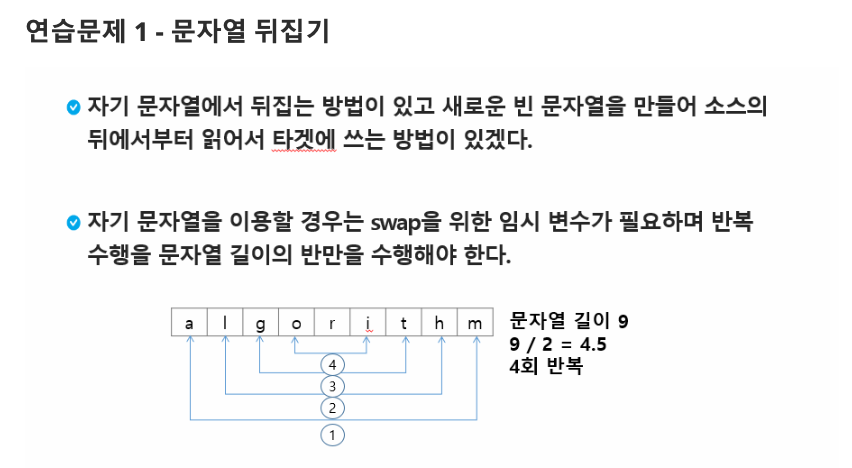
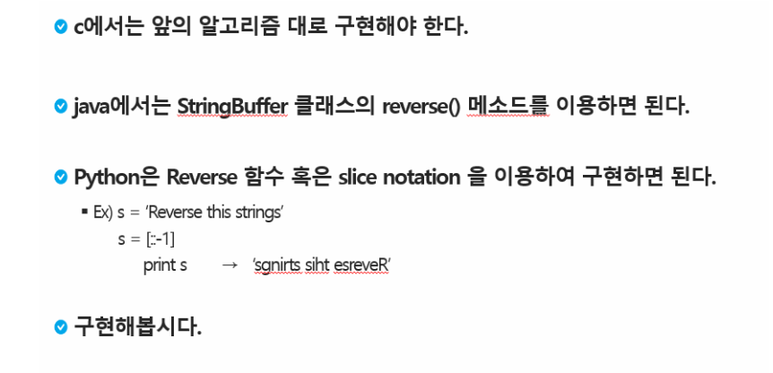

# 연습문제. 문자열 뒤집기 

## 문제 출처

## 💡 접근 방식 1

### 1. 사용 알고리즘
* **구현(Implementation)**
* **문자열 처리**

### 2. 문제 풀이 과정
1.  먼저 문자열을 뒤집는 함수 `reverse_str(s)`를 정의합니다.
2.  빈 리스트 `reversed_s`를 생성하여 뒤집힌 순서의 문자를 저장할 준비를 합니다.
3.  `for` 반복문을 사용하여 입력받은 문자열 `s`의 길이만큼 순회합니다. 이때, `s[-1-i]`와 같이 음수 인덱스를 활용하여 문자열의 끝에서부터 문자를 가져옵니다.
4.  가져온 문자를 `reversed_s` 리스트에 순서대로 `append`합니다.
5.  반복문이 종료되면 `reversed_s` 리스트에 뒤집힌 순서의 문자 조각들이 담기게 됩니다.
6.  `"".join(reversed_s)`를 사용하여 리스트의 모든 요소를 하나의 문자열로 결합합니다.
7.  완성된 뒤집힌 문자열을 반환합니다.
8.  각 테스트 케이스마다 `reverse_str` 함수를 호출하여 결과를 얻고, 출력 형식에 맞춰 출력합니다.

## 💻 코드
* [0000.py](0000.py)

---

## 💡 접근 방식 2

### 1. 사용 알고리즘
* **구현(Implementation)**
* **문자열/리스트 처리** 및 **스와핑(Swapping)**

### 2. 문제 풀이 과정
1.  먼저 문자열을 뒤집는 함수 `reverse_str(s)`를 정의합니다.
2.  입력받은 문자열 `s`를 리스트 형태로 변환하여 요소의 변경이 가능하도록 합니다.
3.  `for` 반복문을 사용하여 리스트 길이의 절반만큼 순회합니다.
4.  각 반복마다 `i`번째 인덱스의 문자와 `(-1-i)`번째 인덱스의 문자를 `s[i], s[-1-i] = s[-1-i], s[i]`와 같이 교환(swap)합니다.
5.  모든 교환이 완료된 후, `"".join(s)`를 사용하여 리스트를 다시 하나의 문자열로 결합합니다.
6.  최종적으로 완성된 뒤집힌 문자열을 반환합니다.

## 💻 코드
* [0000v2.py](0000v2.py)

---

## 💡 접근 방식 3

### 1. 사용 알고리즘
* **구현(Implementation)**
* **문자열 처리**

### 2. 문제 풀이 과정
1.  먼저 테스트 케이스의 개수 `T`를 입력받습니다.
2.  `for` 반복문을 사용하여 각 테스트 케이스마다 문자열 `s`를 입력받습니다.
3.  빈 문자열 `reversed_s`를 생성하여 뒤집힌 문자열을 저장할 준비를 합니다.
4.  `for char in s` 반복문을 사용하여 `s`의 첫 글자부터 마지막 글자까지 순회합니다.
5.  `reversed_s = char + reversed_s`와 같이 현재 문자를 `reversed_s`의 앞에 계속 추가하는 방식으로 문자열을 뒤집습니다.
6.  `for` 반복문이 종료되면 `reversed_s`에 뒤집힌 문자열이 완성됩니다.
7.  최종 결과를 테스트 케이스 번호와 함께 출력 형식에 맞춰 출력합니다.

## 💻 코드
* [0000v3.py](0000v3.py)