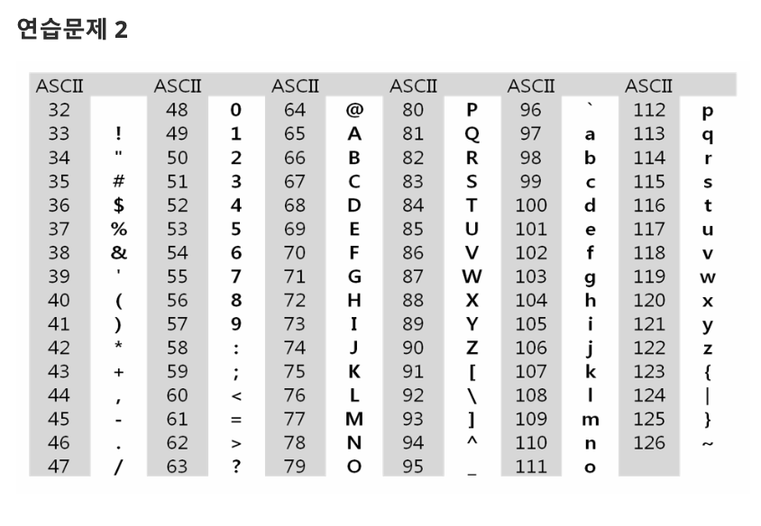
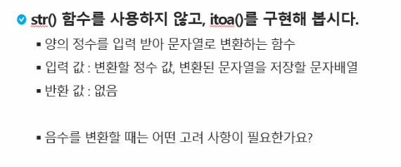

# 연습문제. integer to ascii

## 문제 출처

## 💡 접근 방식

### 1. 사용 알고리즘
* **구현(Implementation)**
* **반복문** 및 **문자열 처리**

### 2. 문제 풀이 과정
1.  먼저 테스트 케이스의 개수 `T`를 입력받습니다.
2.  이 문제는 정수를 문자열로 변환하는 과정을 직접 구현해야 합니다.
3.  `itoa(integer_value)` 함수를 정의하여 정수를 입력받고 문자열을 반환하도록 합니다.
4.  함수 내부에서는 입력받은 정수가 `0`일 경우 `'0'`을 반환하는 예외 처리를 합니다.
5.  음수일 경우를 대비해 `is_negative` 변수를 설정하고, 정수를 양수로 변환하여 처리합니다.
6.  `while` 반복문을 사용하여 정수가 `0`보다 클 동안 `10`으로 나눈 나머지를 구하고, `chr(나머지 + 48)`을 통해 아스키 코드 값을 문자로 변환합니다.
7.  변환된 문자를 `string_value`의 앞에 추가하여 숫자가 역순으로 쌓이는 것을 방지합니다.
8.  `integer_value`를 `10`으로 나눈 몫으로 갱신하여 다음 자리 수를 처리합니다.
9.  반복문이 종료된 후, `is_negative`가 `True`이면 `'-'`를 `string_value`의 앞에 추가합니다.
10. 최종적으로 완성된 문자열을 반환합니다.
11. 각 테스트 케이스마다 `itoa` 함수를 호출하여 정수를 문자열로 변환하고, 그 결과를 `type()` 함수와 함께 출력 형식에 맞춰 출력합니다.

---

## 💻 코드
* [0001.py](0001.py)