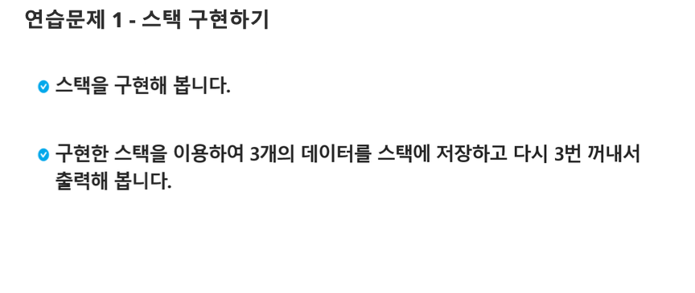

# 연습문제. 스택 구현하기 

## 문제 출처

## 💡 접근 방식

### 1. 사용 알고리즘
* **구현(Implementation)**
* **스택(Stack)** 자료구조

### 2. 문제 풀이 과정
1.  **스택(Stack)**은 데이터를 일시적으로 저장하기 위해 사용하는 자료구조로, 가장 나중에 들어온 데이터가 가장 먼저 나가는 **후입선출(LIFO: Last-In, First-Out)** 방식을 따릅니다.
2.  Python에서는 리스트(`list`)의 `append()` 메소드와 `pop()` 메소드를 활용하여 스택을 간단하게 구현할 수 있습니다.
3.  `append()` 메소드는 스택에 데이터를 추가하는 **push** 연산을, `pop()` 메소드는 스택의 가장 마지막 데이터를 제거하면서 반환하는 **pop** 연산을 수행합니다.
4.  이 코드에서는 `append()`를 사용하여 `1`, `2`, `3`을 스택에 차례대로 추가한 후, `pop()`을 사용하여 마지막에 추가된 `3`부터 순서대로 제거하며 출력합니다.

---

## 💻 코드
* [0000.py](0000.py)