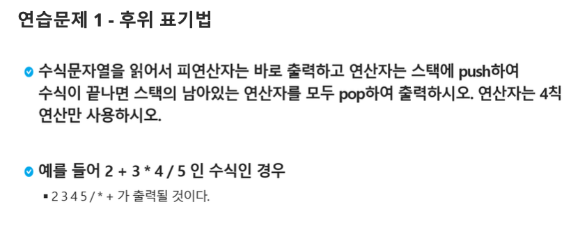

# 연습문제. 후위 표기법

## 문제 출처

## 💡 접근 방식

### 1. 사용 알고리즘
* **스택(Stack)** 자료구조
* **중위 표기식(Infix)을 후위 표기식(Postfix)으로 변환**

### 2. 문제 풀이 과정
1.  주어진 수식 문자열을 순차적으로 읽으면서 **피연산자**는 바로 결과 리스트에 추가하고, **연산자**는 스택에 저장하는 방식을 사용합니다.
2.  `stack`과 `result`라는 빈 리스트를 각각 생성하여 연산자와 최종 결과를 관리합니다.
3.  입력받은 `expression` 문자열을 순회하며 각 토큰을 확인합니다.
4.  토큰이 연산자(`+-*/`)이면, 스택에 `push`(`append`)합니다. 이 코드에서는 연산자 우선순위를 고려하지 않고 단순히 스택에 추가하는 방식을 따릅니다.
5.  토큰이 피연산자(숫자)이면, 바로 결과 리스트에 `append`합니다.
6.  `for` 반복문이 끝난 후, 스택에 남아있는 연산자들을 모두 `pop()`하여 결과 리스트에 추가합니다.
7.  `''.join(result)`를 사용하여 리스트에 담긴 요소들을 하나의 문자열로 결합하고 반환합니다.

---

## 💻 코드
* [0000.py](0000.py)