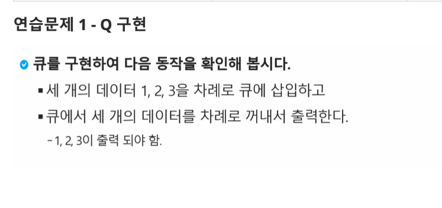

# 연습문제. queue

## 문제 출처

##💡 세 가지 큐 구현 방식 비교

| 구분 | `append()`, `pop(0)` 리스트 메서드 활용 | `collections.deque` 모듈 활용 | 원형 큐 `class` 생성 |
| :--- | :--- | :--- | :--- |
| **장점** | 별도의 라이브러리/클래스 정의 없이 간단하게 구현 가능 | `popleft()` 등 큐 연산에 최적화되어 **가장 효율적인 성능** 제공 | 큐의 동작 원리를 이해하고 직접 구현하는 데 용이 |
| **단점** | `pop(0)` 연산 시 리스트의 모든 요소를 앞으로 이동시켜야 하므로 **비효율적** | `collections` 모듈을 import 해야 함 | 복잡한 코드가 필요하고, 디버깅이 어렵다 |
| **활용** | 데이터가 적은 경우, 간단한 큐 동작만 필요할 때 | **대용량 데이터**를 처리하거나 높은 성능이 요구될 때 | 자료구조 학습용, 큐의 내부 동작을 구현할 때 |
| **시간 복잡도** | `enqueue`: O(1) `dequeue`: O(N) | `enqueue`: O(1) `dequeue`: O(1) | `enqueue`: O(1) `dequeue`: O(1) |

---
- **`append()`, `pop(0)` 리스트 메서드 활용**: 가장 직관적이고 코드가 간단하지만, `pop(0)` 연산은 리스트의 모든 요소를 재배치해야 하므로 데이터의 양이 많아질수록 성능이 급격히 저하되는 단점이 있습니다.

- **`collections.deque` 모듈 활용**: `deque`(Double-ended queue)는 양쪽 끝에서의 삽입과 삭제가 모두 O(1)의 시간 복잡도로 구현되어 있어, 큐의 `enqueue`(append)와 `dequeue`(popleft) 연산에 가장 효율적인 방법입니다.

- **원형 큐 `class` 생성**: `front`와 `rear` 포인터를 사용하여 큐의 논리적인 시작과 끝을 관리하고, 인덱스를 순환시켜 메모리를 재활용하는 방식입니다. 큐의 동작 원리를 깊이 이해하고 싶을 때 직접 구현해 볼 수 있는 방법입니다.

---

## 💻 코드
* [0000.py](0000.py)
* [0000v2.py](0000v2.py)
* [0000v3.py](0000v3.py)