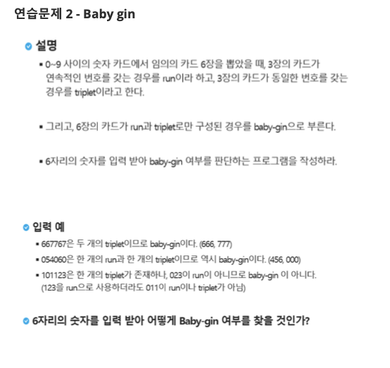

# 0000. Baby Gin

## 문제 출처

## 💡 접근 방식

### 1. 사용 알고리즘
* **구현(Implementation)**
* **브루트포스(Brute-force)**
* **순열(Permutations)**

### 2. 문제 풀이 과정
1.  먼저 6장의 카드 숫자를 입력받아 리스트 형태로 저장합니다.
2.  Python의 `itertools` 모듈에 있는 `permutations` 함수를 사용하여 6장의 카드로 만들 수 있는 모든 순열(경우의 수)을 생성합니다.
3.  각 순열(`card_set`)을 앞의 3장과 뒤의 3장으로 나누어 `Baby Gin`의 조건을 만족하는지 확인합니다.
4.  3장의 카드가 `triplet`(같은 숫자 3개)인지 확인하는 함수와 `run`(연속된 숫자 3개)인지 확인하는 함수를 따로 정의하여 사용합니다.
5.  두 개의 3장짜리 카드 묶음이 모두 `triplet`이거나 `run`이면 `Baby Gin`이 성립하므로, `result`를 `1`로 설정하고 `break`를 통해 반복문을 종료합니다.
6.  모든 순열을 확인했음에도 `Baby Gin`이 성립하는 경우가 없다면 `result`는 `0`으로 유지됩니다.
7.  최종 결과를 테스트 케이스 번호와 함께 출력 형식에 맞춰 출력합니다.

---

## 💻 코드
* [0000.py](0000.py)