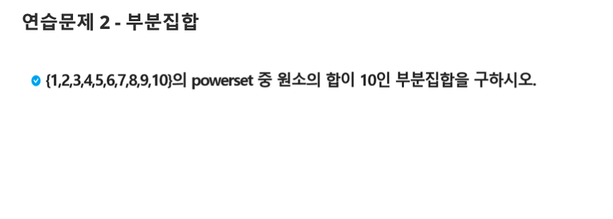

# 0001. 부분 집합

## 문제 출처

## 💡 접근 방식

### 1. 사용 알고리즘
* **조합 (Combinations)**
* **브루트포스 (Brute-force)**
* **구현 (Implementation)**

### 2. 문제 풀이 과정
1.  1부터 10까지의 숫자를 원소로 가지는 리스트 `arr`를 생성합니다.
2.  Python의 `itertools` 모듈에 있는 `combinations` 함수를 사용해 `arr`의 모든 부분 집합을 생성합니다.
3.  부분 집합의 원소 개수(`r`)를 1부터 10까지 변화시키는 반복문을 사용해 모든 크기의 부분 집합을 고려합니다.
4.  생성된 각 부분 집합(`powerset`)의 합을 `sum()` 함수로 계산합니다.
5.  부분 집합의 합이 10인 경우, 해당 부분 집합을 `result` 리스트에 추가합니다.
6.  모든 경우의 수에 대한 탐색이 끝나면, `result` 리스트에 저장된 합이 10인 부분 집합들을 하나씩 출력합니다.

---

## 💻 코드
* [0001.py](0001.py)