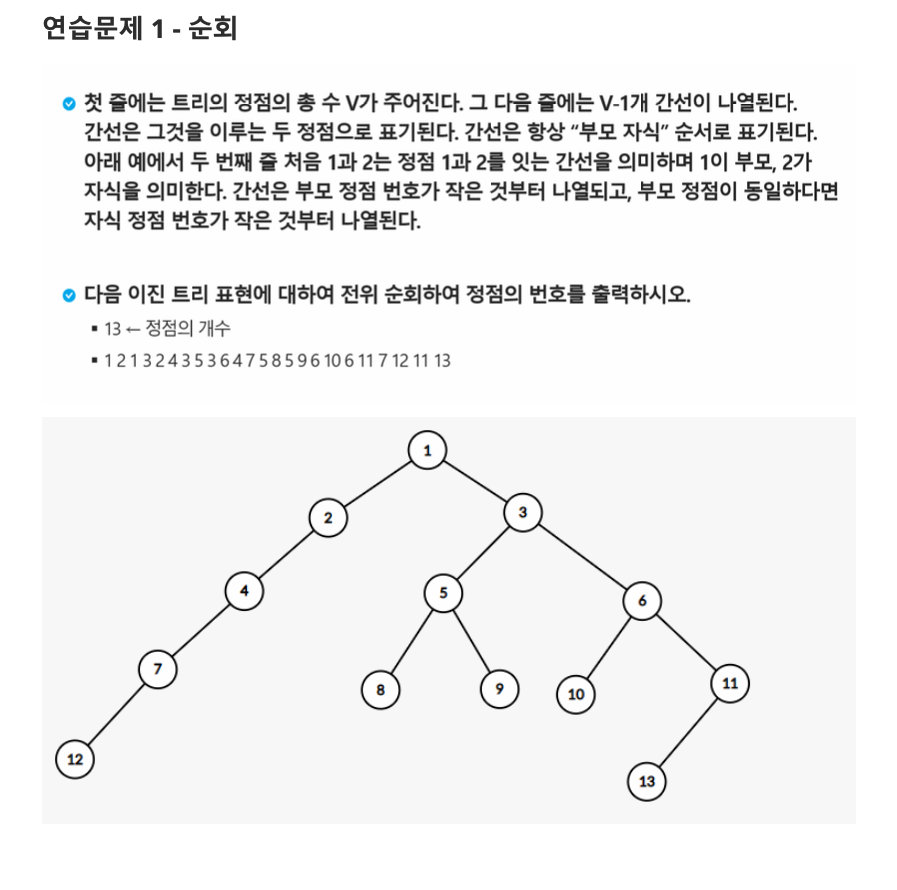

# 0000. 순회

## 문제 출처

## 💡 접근 방식

### 1. 사용 알고리즘
* **트리 (Tree)**
* **재귀 (Recursion)**
* **전위 순회 (Pre-order Traversal)**

### 2. 문제 풀이 과정
1.  **트리 구조 표현**: 정점의 개수 `V`를 입력받아, 각 정점의 자식 노드 정보를 저장할 `left`와 `right` 두 개의 리스트(배열)를 생성합니다. `left[i]`는 `i`번 노드의 왼쪽 자식을, `right[i]`는 오른쪽 자식을 저장합니다.
2.  **간선 정보로 트리 구성**: 입력으로 주어진 간선 정보(부모-자식 쌍)를 순회하며 `left`와 `right` 리스트를 채워 트리를 구성합니다.
    * 간선 `(parent, child)`에 대해, `left[parent]`가 비어있으면 `child`를 왼쪽 자식으로 등록합니다.
    * `left[parent]`에 이미 자식이 있다면 `child`를 오른쪽 자식으로 등록합니다.
3.  **전위 순회(Pre-order) 함수 정의**: 재귀를 사용하여 전위 순회를 구현합니다. 전위 순회는 **V(방문) -> L(왼쪽 자식) -> R(오른쪽 자식)** 순서로 동작합니다.
    * `preorder(node)` 함수는 현재 노드 `node`를 인자로 받습니다.
    * **Base Case**: `node`가 `0`이면(자식이 없으면) 함수를 종료합니다.
    * **Recursive Step**:
        1.  현재 노드 `node`의 번호를 출력합니다 **(V)**.
        2.  `preorder(left[node])`를 호출하여 왼쪽 서브트리를 순회합니다 **(L)**.
        3.  `preorder(right[node])`를 호출하여 오른쪽 서브트리를 순회합니다 **(R)**.
4.  **순회 시작**: 루트 노드인 `1`을 시작으로 `preorder(1)` 함수를 호출하여 전체 트리 순회를 시작하고 결과를 출력합니다.

---

## 💻 코드
* [0000.py](0000.py)