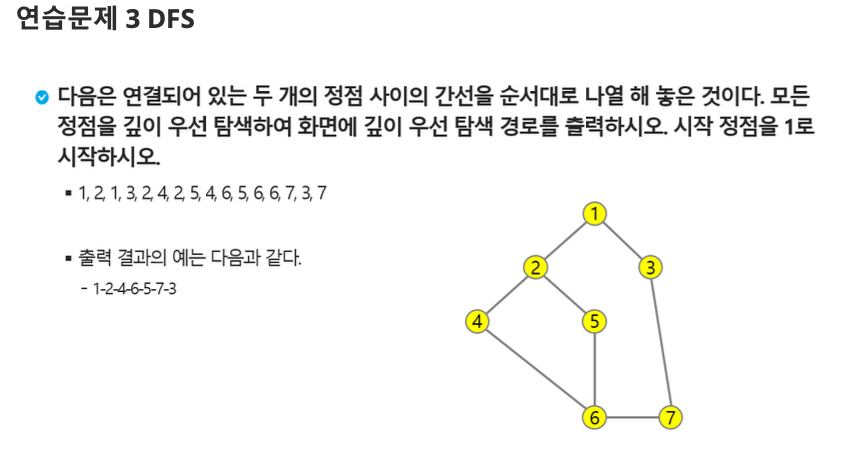

# 연습문제. DFS

## 문제 출처

## 💡 접근 방식

### 1. 사용 알고리즘
* **그래프 (Graph)**
* **깊이 우선 탐색 (DFS, Depth-First Search)**
* **재귀 (Recursion)**

### 2. 문제 풀이 과정
1.  **그래프 표현**: 정점(Vertex)과 간선(Edge) 정보를 저장하기 위해 **인접 리스트(Adjacency List)** 방식을 사용합니다. `adj_list[i]`는 `i`번 정점과 직접 연결된 모든 정점들의 리스트를 담습니다. 주어진 간선은 방향이 없으므로, `(n1, n2)` 정보가 들어오면 `adj_list[n1]`에 `n2`를, `adj_list[n2]`에 `n1`을 각각 추가하여 양방향 관계를 표현합니다.
2.  **DFS 함수 설계 (재귀)**:
    * `dfs(start_node, path)` 함수는 **재귀 호출**을 기반으로 동작합니다. `path` 리스트는 탐색 경로를 누적하여 기록하는 역할을 합니다.
    * **방문 처리**: 함수가 호출되면, 먼저 현재 노드 `start_node`를 방문했다는 의미로 `visited[start_node]`를 `True`로 변경하고 `path`에 추가합니다. `visited` 배열은 한 번 방문한 노드를 다시 방문하지 않도록 하여 무한 루프를 방지합니다.
    - **탐색 확장**: 현재 노드와 인접한 모든 노드(`next_node`)를 순회하면서, 아직 방문하지 않은(`not visited[next_node]`) 노드가 있다면 해당 노드를 시작점으로 `dfs` 함수를 재귀적으로 호출합니다.
3.  **탐색 시작 및 결과 출력**:
    * `visited` 배열을 `False`로 초기화합니다.
    * 시작점인 `1`번 노드부터 `dfs(1)`을 호출하여 탐색을 시작합니다.
    * 탐색이 모두 종료되면, `dfs` 함수는 최종 탐색 경로가 담긴 `path` 리스트를 반환합니다.
    * 반환된 리스트의 원소들을 문자열로 변환하여 출력 형식에 맞게 출력합니다.

---

## 💻 코드
* [0000.py](0000.py)