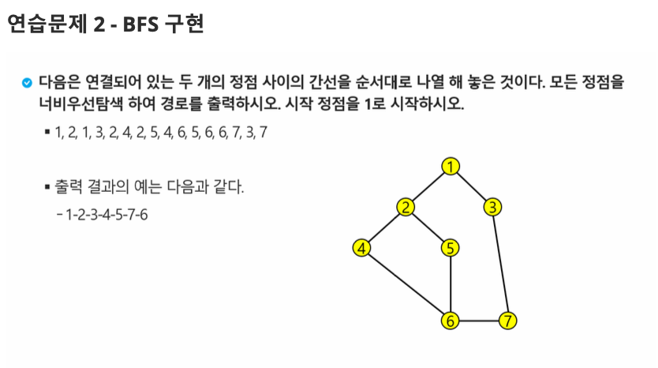

# 연습문제. BFS

## 문제 출처

## 💡 접근 방식

### 1. 사용 알고리즘
* **그래프 (Graph)**
* **너비 우선 탐색 (BFS, Breadth-First Search)**
* **큐 (Queue)**

### 2. 문제 풀이 과정
1.  **그래프 표현**: 정점(Vertex)과 간선(Edge) 정보를 저장하기 위해 **인접 리스트(Adjacency List)** 방식을 사용합니다. `adj_list[i]`는 `i`번 정점과 직접 연결된 모든 정점들의 리스트를 담습니다. 주어진 간선은 방향이 없으므로, 양방향 관계를 표현해줍니다.
2.  **BFS 함수 설계**:
    * `bfs(start_node)` 함수는 **큐(Queue)** 자료구조를 기반으로 동작합니다. 파이썬에서는 `collections.deque`를 사용해 효율적인 큐를 구현합니다.
    * `visited` 배열을 통해 한 번 방문한 노드는 다시 큐에 추가되지 않도록 하여 무한 루프를 방지합니다.
    * **탐색 로직**:
        1. 시작 노드(`start_node`)를 큐에 넣고 방문 처리합니다.
        2. 큐가 비어있지 않은 동안 다음을 반복합니다.
        3. 큐에서 노드 하나를 꺼내(`popleft`) `path`에 추가합니다.
        4. 꺼낸 노드와 인접한 모든 노드들을 확인하며, 아직 방문하지 않았다면 방문 처리 후 큐에 추가(`append`)합니다.
3.  **탐색 시작 및 결과 출력**:
    * 시작점인 `1`번 노드부터 `bfs(1)`을 호출하여 탐색을 시작합니다.
    * 탐색이 모두 종료되면, `bfs` 함수는 최종 탐색 경로가 담긴 `path` 리스트를 반환합니다.
    * 반환된 리스트의 원소들을 문자열로 변환하여 출력 형식에 맞게 출력합니다.

---

## 💻 코드
* [0000.py](0000.py)