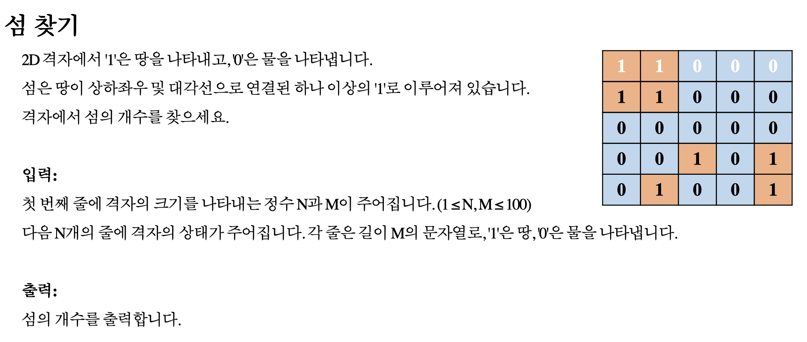

# 연습문제. 섬 찾기

## 문제 출처

## 💡 접근 방식

### 1. 사용 알고리즘
* **그래프 (Graph)**
* **너비 우선 탐색 (BFS, Breadth-First Search)**
* **큐 (Queue)**
* **연결 요소 (Connected Components)**

### 2. 문제 풀이 과정
1.  **그래프 모델링**: 지도를 그래프로 간주합니다. 땅('1')으로 표시된 각 칸은 정점(Vertex)이 되며, 상하좌우 및 대각선으로 인접한 땅들은 서로 연결된 간선(Edge)을 가집니다. 문제의 목표는 이 그래프에서 **연결 요소(Connected Component)의 개수**, 즉 서로 분리된 땅 덩어리(섬)의 수를 세는 것입니다.
2.  **전체 그리드 순회**: `for` 루프를 사용해 지도의 모든 칸`(i, j)`을 순차적으로 확인합니다.
3.  **섬 발견 로직**:
    * 순회 중 아직 방문하지 않은(`not visited[i][j]`) 땅(`grid[i][j] == '1'`)을 발견합니다.
    * 이는 새로운 섬의 일부를 처음으로 발견했음을 의미하므로 `island_count`를 1 증가시킵니다.
4.  **BFS를 이용한 섬 전체 탐색**:
    * 새로운 섬을 발견한 즉시, 해당 위치 `(i, j)`를 시작점으로 `bfs` 함수를 호출합니다.
    * `bfs` 함수는 **큐(Queue)** 자료구조를 이용하여, 시작점과 인접한 땅들을 먼저 탐색하고 점차적으로 탐색 범위를 넓혀나갑니다.
    * `bfs` 탐색 과정에서 방문하는 모든 땅은 `visited` 배열에 `True`로 방문 표시를 남깁니다.
    * `bfs`가 종료되면, 하나의 완전한 섬(연결 요소) 전체가 방문 처리됩니다.
5.  **결과 도출**: 전체 그리드 순회가 끝나면 `island_count`에는 최종적으로 발견된 섬의 총개수가 저장됩니다. `bfs`를 통해 한 번 발견된 섬의 모든 부분은 방문 처리되므로, 같은 섬이 중복으로 계산되는 것을 방지할 수 있습니다.

---

## 💻 코드
* [0001.py](0001.py)