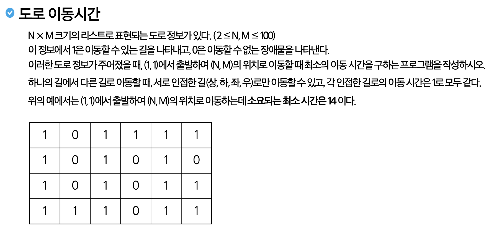

# 연습문제. 도로 이동 시간

## 문제 출처

## 💡 접근 방식

### 1. 사용 알고리즘
* **그래프 (Graph)**
* **너비 우선 탐색 (BFS, Breadth-First Search)**
* **최단 경로 (Shortest Path)**
* **큐 (Queue)**

### 2. 문제 풀이 과정
1.  **문제 모델링**: 도로 지도를 그래프로 간주합니다. 각 칸은 정점(Vertex)이며, '1'(도로)로 표시된 인접한(상하좌우) 칸들은 서로 연결된 간선(Edge)을 가집니다. 문제는 (0, 0)에서 (N-1, M-1)까지의 **최단 경로** 길이를 찾는 것입니다.
2.  **알고리즘 선택**: 가중치가 없는 그래프에서 최단 경로를 찾는 데에는 **너비 우선 탐색(BFS)**이 가장 효율적이고 정확한 알고리즘입니다. BFS는 시작점으로부터 거리가 가까운 정점부터 순서대로 탐색하기 때문에, 목적지에 처음 도달했을 때의 경로가 곧 최단 경로가 됨을 보장합니다.
3.  **BFS를 이용한 최단 거리 계산**:
    * `visited` 2차원 배열을 단순한 방문 여부 확인뿐만 아니라, **시작점으로부터의 최단 거리**를 저장하는 용도로 사용합니다.
    * `bfs` 함수를 시작할 때, 시작점 `(0, 0)`을 큐에 넣고 `visited[0][0]`을 `1`로 초기화합니다.
    * 큐에서 현재 칸 `(r, c)`를 꺼낸 후, 인접한 칸 `(nr, nc)`로 이동할 때마다 `visited[nr][nc]`에 `visited[r][c] + 1` 값을 저장합니다. 이는 `(nr, nc)`까지의 최단 거리가 `(r, c)`까지의 최단 거리에 1을 더한 값임을 의미합니다.
4.  **결과 도출**:
    * `bfs` 탐색이 모두 끝나면, `visited[N-1][M-1]`에는 시작점부터 도착점까지의 최단 경로에 포함된 칸의 총개수(경로 길이)가 저장됩니다.
    * 문제에서 요구하는 '이동 시간'은 총 이동 횟수를 의미하므로, **(경로 길이 - 1)**을 계산하여 최종 결과로 출력합니다.

---

## 💻 코드
* [0002.py](0002.py)